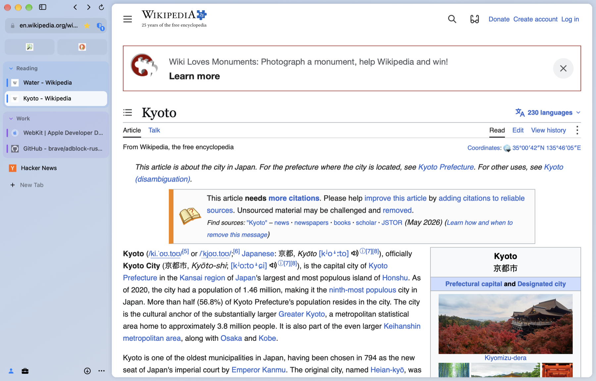
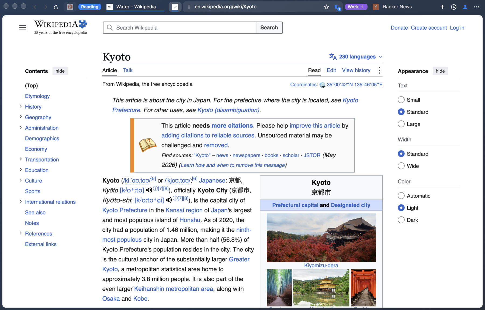
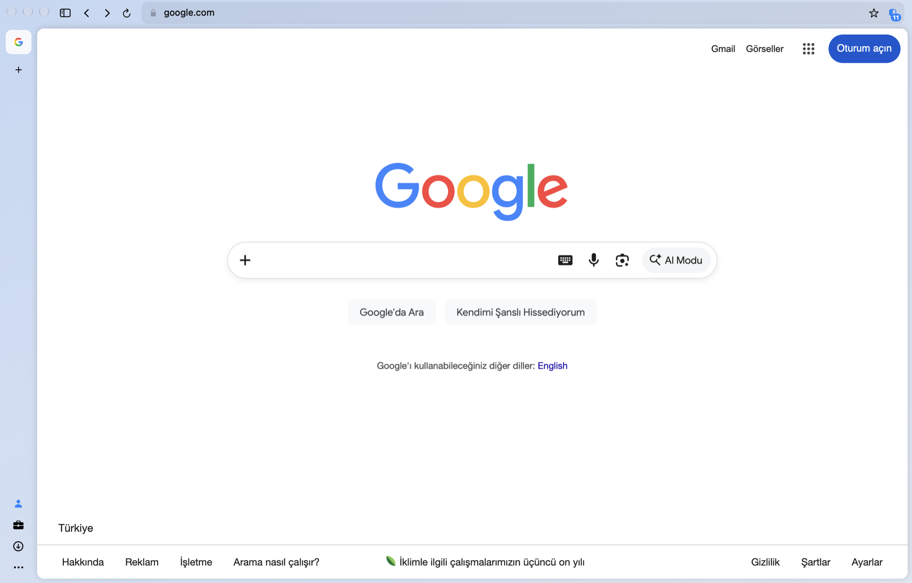
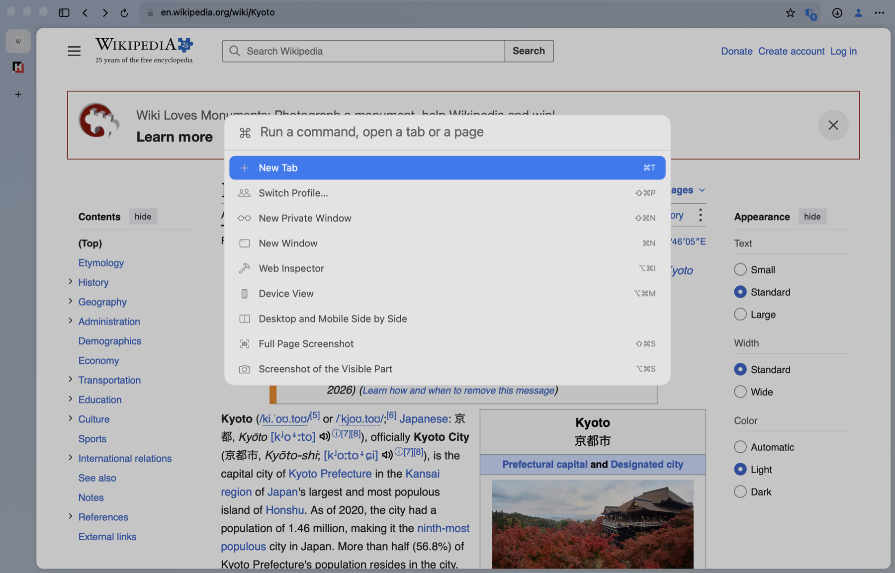
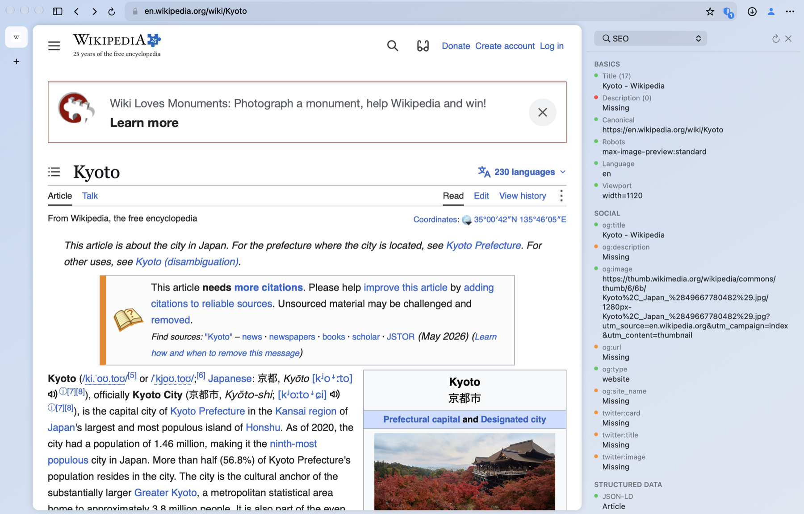
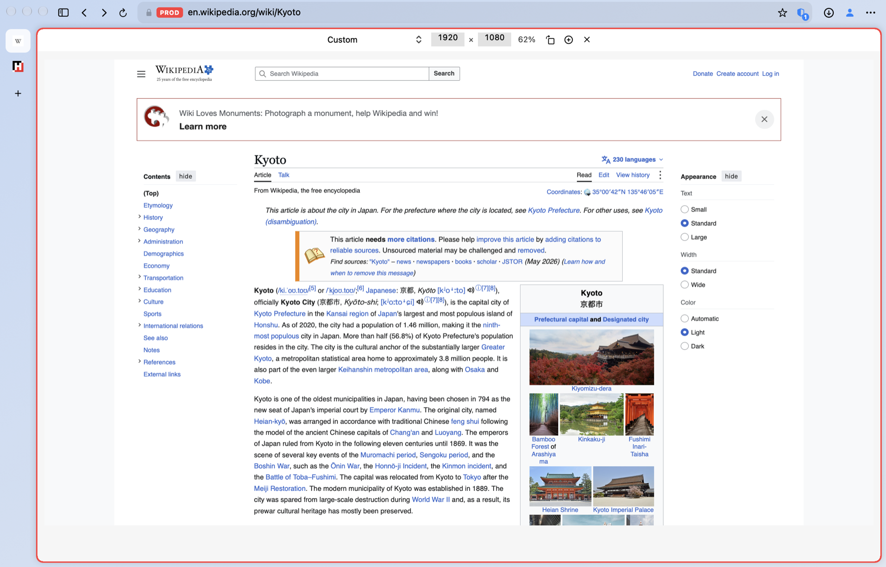
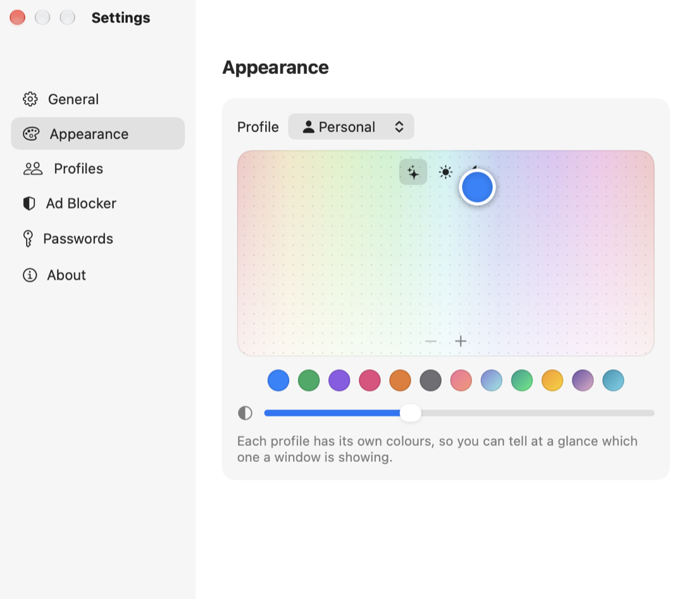

# Mizu

A calm, light web browser for macOS: a native AppKit interface on WebKit, with
ad blocking by Brave's [adblock-rust](https://github.com/brave/adblock-rust)
built in. *Mizu* (水) is Japanese for water.



| Tabs along the top | Narrow sidebar |
| --- | --- |
|  |  |

| Command palette | Audits beside the page |
| --- | --- |
|  |  |

| Device view | Theme |
| --- | --- |
|  |  |

## Features

- **Tabs where you want them**: in a sidebar, which collapses to a narrow
  strip of icons, or along the top, where tabs and address share a single row
  as in Safari (or take a row each). Pinned tabs, named and coloured groups
  that fold away, drag to reorder
- **Light on memory**: the tab in front is live, the few you used last stay
  loaded, and the rest (and any left unused for 15 minutes) are put to sleep and come back where you left them
  when you pick them. When the Mac runs short of memory, the loaded ones go
  to sleep too
- **Ad and tracker blocking**, on from the start. Filter lists (EasyList,
  EasyPrivacy, uBlock filters, AdGuard Tracking Protection; Turkish and
  cookie-banner lists on request) are read by adblock-rust; the shield in the
  address bar counts what was blocked and switches the blocker off per site
- **Profiles**, such as Personal and Work: each has its own cookies and site
  data, history, bookmarks, tabs and colours. Private windows that leave
  nothing behind
- **A theme you pick from a colour field**, in the manner of Zen and Arc: drag
  a dot, add a second one for a gradient, set how strongly it tints the window
- **Passwords from the Passwords app**: on a sign-in page a key appears in the
  address bar; Passwords asks for Touch ID, and the account you pick is filled
  into the page. An account can be kept with the profile, in the macOS
  keychain
- **A profile per client**, for agencies: pin the client's tools (GitHub,
  Figma, Analytics, Search Console, Meta Ads…) so they are a click away, keep
  the client's accounts with the profile, and switch client with ⇧⌘P. Sites
  are labelled production, staging or development in the address bar and
  framed in colour, so that the live site is never mistaken for the test one
- **A palette in the middle of the window**: ⌘T to type where to go, ⌘K to
  run any command or jump to a tab
- **For developers**: Web Inspector; a device view with phones, tablets,
  desktop widths and any size you type, scaled to fit, or desktop and mobile
  side by side; screenshots of the page, the visible part or one element;
  user agent presets; switches for the cache and JavaScript; clearing one
  site's data
- **Quick audits beside the page** (⌥⌘D): SEO (title, description, canonical,
  robots, Open Graph, structured data, headings), accessibility (names,
  labels, heading order, contrast), the requests a page makes and the
  trackers that were blocked, cookies and storage, broken links, the font and
  colours of any element, a colour picker, and CSS to try on the page
- Downloads, history, bookmarks, find in page, zoom, print, save as PDF
- English and Turkish; follows the system language or the one you choose
- Updates itself from GitHub releases (each download is checked against the
  developer's signature before it is installed)

Not there yet: passkeys (macOS reserves them for browsers Apple has granted
an entitlement), browser extensions, syncing between Macs, and network
throttling (WebKit gives an app no way to slow a page's connection; Web
Inspector has its own).

## Install

Requires macOS 26 or later on Apple silicon.

```bash
brew install --cask mdenizay/tap/mizu
```

The app is signed and notarized, so it opens like any other. To make it the
default browser, use Settings → General.

## Build from source

You need Xcode 26 or later and Rust.

```bash
brew install rust
./build.sh
open dist/Mizu.app
```

## How it is put together

| Part | What it is |
| --- | --- |
| `adblock/` | Rust. A small C surface over adblock-rust, built as a static library. |
| `app/` | Swift. The interface (AppKit, with SwiftUI for Settings), linked against the library. History, bookmarks and the open tabs are kept in SQLite through [GRDB](https://github.com/groue/GRDB.swift). |
| `tools/` | The script that draws the icon, the release script and a development helper. |

**Blocking.** WebKit does not let an app see or cancel a page's requests, so
the network filters are translated by adblock-rust into WebKit content rules
and WebKit does the blocking itself; nothing is matched in Mizu's own process.
What content rules cannot express (hiding elements by class and id,
scriptlets) is answered by an adblock-rust engine that holds only the
cosmetic rules. The filter lists are downloaded from their authors on first
launch and every few days after; none are bundled.

**Memory.** A tab always knows its address and title; the web view behind it
exists only while the tab is loaded. Putting a tab to sleep saves its
back/forward list and drops the web view, and with it the page's process.

**Profiles.** Each profile is a separate `WKWebsiteDataStore`, so sites see
entirely different cookies and storage in each.

Data lives in `~/Library/Application Support/Mizu/`. Mizu sends nothing
anywhere except the requests of the pages you open, the filter list downloads
and the check for a new version on GitHub.

## Credits and license

- [adblock-rust](https://github.com/brave/adblock-rust) by Brave (MPL-2.0),
  and the scriptlets of [adblock-resources](https://github.com/brave/adblock-resources)
- [GRDB.swift](https://github.com/groue/GRDB.swift) by Gwendal Roué (MIT)
- The filter lists of EasyList, uBlock Origin and AdGuard, under their own
  licenses

This project's own code is released under the MIT License; see `LICENSE`.
